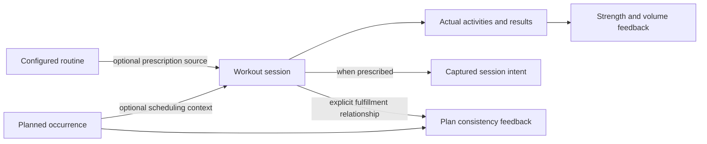

# Hephaestus Conceptual Model and Feature Exploration

Date: 2026-10-02  
Status: follow-up interview contracts confirmed; storage/API design and explicitly exploratory features remain unapproved.
Repository baseline: `bb294de35b76a3c7eba0d17d8a305c9242eb6831`.

Read the [domain vocabulary](hephaestus-domain-vocabulary-20261002.md) first. The [UX handoff](hephaestus-ux-routines-handoff-20261002.md) records the earlier decisions and research. This document asks what the product should be capable of expressing—not which tables, columns, keys, files or API messages to create.

## Product questions the model must serve

Confirmed:

1. What should I train next, without losing an unfinished workout?
2. How do I configure a reusable prescription and log actual performance quickly?
3. Can I start and record an ad-hoc workout without preparing a template, routine or schedule?
4. Am I getting stronger?
5. Am I following my plan consistently?
6. Am I balancing training volume across muscle groups and movement patterns, and what is my total volume?
7. Can I correct a mistaken record without rewriting what I originally intended or silently changing future workouts?

The model describes confirmed domain contracts, not a reverse-engineered database. Routine means one reusable configured workout; Training Plan means the personal arrangement; Program is now confirmed as a distinct reusable multi-week template-based design. Physical representation follows these contracts.

## 1. Center actual training, not the template chain

A workout is a first-class record of actual training. Scheduling and reusable prescription are independent, optional sources of context.

A reusable routine is an optional source of prescription, not the definition of prescription itself. One-off intended targets can conceptually be supplied without saving a template or routine; session-only authoring/amendment is a review topic, not a requirement to create reusable objects.

|                      | Prescription supplied                                                                                                                                  | No prescription supplied                                                                   |
| -------------------- | ------------------------------------------------------------------------------------------------------------------------------------------------------ | ------------------------------------------------------------------------------------------ |
| Scheduled            | Perform the prescribed workout selected for an occurrence.                                                                                             | Possible extension: a planned open training slot, with details decided during the session. |
| Unscheduled / ad hoc | Start Push A spontaneously, capturing its prescription without claiming a calendar appointment; one-off supplied intent is also conceptually possible. | Start freestyle, choose activities and log actual work directly.                           |

Both ad-hoc paths are confirmed requirements. A scheduled freestyle slot is an exploratory modeling case, not approved new feature scope. No mandatory template, routine, program or training-plan creation precedes ad-hoc logging.



A freeform workout is not a separate inferior record type. It receives the same applicable logging, reload recovery, completion, retrospective correction, history, progress and portability support. Exercise-specific measurement eligibility applies equally regardless of scheduling origin.

No supplied prescription is known absence, not a fabricated empty routine. Historical intent that was never captured is unavailable, which is a different fact. Prescription comparison should be absent or partial when appropriate, not a misleading zero-percent score.

## 2. Reusable intent and realised values

```text
Workout template
  ordered activity prescriptions
  grouping and set structure
  defaults and target rules
        |
        | supply inputs, resolve, preview, explicitly save
        v
Configured routine / realised template
  same structure
  saved configuration and explainable resolved targets
        |
        | choose for a scheduled or ad-hoc session
        v
Captured session intent
  prescription as it stood at the start of this workout
        |
        | compare without substituting targets for performance
        v
Actual activities/results
  performed work, skips, extra work and deviations
```

A single template can have several saved realisations—for example, Push A and Light Push with the same structure but different working loads. This reuse is confirmed, not a requirement to impose multiple configuration screens on every user. Plans reference a saved routine rather than silently making private prescription copies; explicitly editing that routine affects future starts from all referencing plans. Different reusable targets require another saved realisation. Already captured session intent and actual results remain unchanged, including those of an unfinished session.

Changing a load input can recalculate dependent values. Changing the exercise list, number/order of sets or execution groups changes structure. The model must distinguish these operations, even if one editor eventually handles both.

A routine retains its adopted template revision, structure, defaults, rules, inputs and resolved values. Template edits do not update it or block starting it. Show newer revisions and let the user explicitly review adoption from the routine, preserving compatible inputs and resolving broken references before saving. Structural variants edit or duplicate the template; a routine does not become an independent structural fork. Captured intent retains provenance and never changes when sources are reconciled.

Activity prescriptions can express strength sets, cardio targets, conditioning intervals and mobility/recovery work using appropriate measurements. Do not force running into weight/rep sets or strength into a universal duration score. Exact activity vocabulary and measurement contracts precede storage design.

Rules calculate scalar prescription values. They do not schedule workouts, add/remove activities, read arbitrary history or authorize automatic progression. Selected historical inputs and progression application need separate, explicit contracts if explored later.

## 3. Organization over time

### Confirmed ownership and program relationships

- A Training Plan may mix calendar, rotation and frequency goals; multiple plans may be active. Plans are optional, not exclusive application modes.
- A reusable Program describes template-based workout slots, weeks/phases and progression intent independently of personal working loads. A personal Training Plan may adopt a Program revision and bind its slots to compatible saved routines, including routines shared with other plans. Standalone plans/routines and ad-hoc work require no Program.
- Editing a Program does not silently update following plans. Reviewed adoption reconciles future organization and bindings under the same protected-appointment rules as schedule edits, preserving today's/overdue/historical commitments, captured intent and actuals.
- Program weeks are seven-local-date blocks from the chosen plan start date: Wednesday to the following Tuesday is week one. Calendar time advances weeks/phases, regardless of misses. This is distinct from Monday–Sunday frequency-goal/reporting weeks. Progression suggestions require explicit acceptance; phases do not silently recalculate or replace saved routines.
- Saved routine prescription and continuation/deferral policy are shared across references. Each plan's calendar appointments are independent. Postponing one appointment never moves another plan's appointment or a different routine.
- Preserve one unfinished session and one browser writer. Several relevant plans/appointments do not create concurrent logging sessions.

### Organization modes

| Mode | Confirmed behavior | Boundary |
| --- | --- | --- |
| Calendar | Independent dated commitments, optional times; original and current planned dates remain distinguishable. | A workout fulfills at most one explicitly selected appointment; no silent similarity matching. |
| Rotation | Ordered routines without invented dates. Linked finish or explicit Skip advances once; start, postponement and unrelated ad-hoc work do not. | History correction/relinking never rewinds or retroactively advances the sequence. |
| Frequency goal | Count finished workouts with completed actual work matching an activity filter, once per workout per Monday–Sunday goal period. | Scheduled and ad-hoc work count automatically; multiple goals may receive credit without duplicating actual-work volume. No minimum-work thresholds or accumulated-work goals in this iteration. |

A frequency shortfall is not an invented missed appointment. Finishing a linked calendar workout with at least one completed activity/set fulfills that appointment even when shortened or under target; empty workouts do not. Prescription attainment is a separate per-field comparison, not a prerequisite for fulfillment.

For ad-hoc work, offer explicit appointment matching at finish. History permits link/unlink/relink with a credit preview. Neither selecting the same routine nor recording similar exercises implicitly fulfills an appointment. Split-session fulfillment and multi-appointment fulfillment are not introduced.

Today prioritizes unfinished-session recovery, dated due/overdue commitments, rotation suggestions, then unmet frequency goals. Use a stable, explainable order inside each group and retain override, alternatives and prominent Start ad-hoc.

### Continuation is not progression

```text
Continuation policy on the saved routine
  calendar-bound: leave a miss; later slots stay unchanged
  carry-forward: retain the same occurrence for a later opportunity
      deferral mode: automatic or manual Postpone

Prescription progression
  reviewed future changes to inputs/fixed targets
  structural changes through template authoring
  never inferred merely from actual deviations
```

An open, unstarted appointment becomes overdue after its current planned local day ends; fulfilled or explicitly skipped commitments do not become new misses. An appointment linked to an unfinished workout remains protected and recoverable. Reconcile on app opening, idempotently, rather than promising offline background execution at midnight.

Automatic carry-forward searches today through the next 27 local dates for the earliest date without another appointment for the same saved routine across active plans. Include recurring commitments, not just currently materialized rows. Other routines may share the day. Retain original timing/identity and every existing commitment; do not merge, delete or shift appointments. If no day is clear, leave the occurrence overdue and offer manual resolution.

Manual Postpone can select a later date, including beyond that horizon or alongside another same-routine appointment after a collision warning. It changes only the selected occurrence. Original planned timing, current planned timing and actual performed timing answer different questions; later fulfillment does not imply original on-time performance.

Schedule edits preview and alter future unstarted appointments only. Preserve today's, overdue, fulfilled/skipped commitments and appointments linked to unfinished work; changes to those require explicit individual actions. Do not reconstruct historical obligations from current schedule rules. New pause/rest automation remains separate scope.

### Confirmed associations

| Relationship | Contract | Scope boundary |
| --- | --- | --- |
| Program to template | Reusable design slots reference templates, not personal configured loads. | Plan adoption validates compatible saved routine bindings. |
| Training Plan to Program | Optional adopted design revision with personal start date and bindings. | New Program revisions require reviewed adoption. |
| Training Plan to organization | Calendar, rotation and goals may coexist; several plans may be active. | These modes do not alter prescription automatically. |
| Training Plan to routine | References the saved shared routine; no implicit private copies. | Independent appointments, shared prescription and continuation/deferral policy. |
| Template to routine | Several saved same-structure realisations are possible. | Structural variants edit/duplicate templates; adoption is explicit. |
| Session to routine | Optional prescription source; freestyle has none. | Combining several source prescriptions remains exploratory. |
| Session to captured intent | Required when supplied, known absent for freestyle, unavailable for some legacy data. | Immutable in this iteration; changes/additions are actual deviations. |
| Session to calendar appointment | At most one explicit appointment link; some completed actual work is required for fulfillment. | Matching offered at ad-hoc finish; historical relinking is explicit, not inferred. |
| Session to goal credit | Automatic once-per-workout credit for each qualifying activity-filtered weekly goal. | Credit does not imply calendar fulfillment or duplicate actual volume. |
| Activity result to intended activity/set | Optional correspondence for comparison. | Freestyle/extra work needs none; missing measurements remain unknown. |

## 4. Workout lifecycle and corrections

The conceptual lifecycle is start, log, optionally pause/reload/resume, then finish or explicitly discard unfinished work. App closure alone is neither completion nor a miss. Finishing a session does not assert that every target was met.

The supported local release retains one unfinished session and one browser writer at a time, including ad-hoc workouts. This is an execution/recovery boundary, not a restriction on how many routines or planned occurrences can exist.

Pending inputs, completed results, explicit skips and extra actual work remain distinct. Exact targets may be visible editable suggestions: ticking explicitly accepts the visible valid values, including the latest edits, without a modal. Missing/invalid required actual fields block completion. Rep ranges require a single entered achieved rep count rather than a fabricated lower-bound actual.

Valid pending edits persist as durable drafts independently of completion and survive reload/resume. They do not contribute to performed-work metrics. Completion records the latest valid edits atomically; undo returns the same values to pending drafts, leaving captured targets unchanged.

Reporting initially groups actual work by the saved start local date, retained across reload/travel. A Sunday-night start finishing Monday initially belongs to Sunday; users may correct the performed date afterward. Elapsed duration uses timestamps.

Retrospective correction may change actual exercise identity, add/remove mistaken actual activity/set rows, or edit load/reps/duration/distance, effort/notes, title and performed date/time. Recompute affected PRs, training load, volume, summaries, weekly goal credit and linked appointment fulfillment atomically. Preserve captured intent and subjective notes unless explicitly edited. Whole-workout deletion is not authorized by this contract.

If corrected work no longer fulfills its linked appointment, show that commitment as unfulfilled for deliberate resolution. Do not rewind an advanced rotation or reschedule unrelated appointments. Historical link/unlink/relink has an explicit credit preview and preserves the one-appointment limit.

Updating future prescription is separate from saving actuals. Offer reviewed input/fixed-target changes and preview dependent targets/shared plan impact. Formula-derived targets change through inputs, not inferred inverse formulas or replacement with actual values. Structural reuse opens separate template edit/duplicate authoring.

Compare captured intent, actuals and the current saved routine before applying future updates. A session captured at 60 kg, routine later edited to 62.5 kg and performed 55 kg must expose all three values and require explicit conflict choices. Preserve unrelated newer edits; never overwrite the current routine with a stale capture. Declining updates leaves changes session-only.

## 5. Progress is three views, not one score

### Strength: am I getting stronger?

Lead with exercise/variant-specific comparable load and rep history, effort when known, and existing labeled e1RM as supporting evidence. Retain the current estimator/eligibility contract rather than introducing a new fitted model. A heavier machine stack or more workout tonnage is not automatically comparable strength improvement.

Retain load convention, units, role and optional effort. Missing effort remains unknown, not assumed equal exertion. Warm-up, unfinished and non-strength work remain excluded from strength PR/e1RM; eligible ad-hoc work is included.

### Consistency: am I following my plan?

Keep these separate:

- A workout happened.
- It explicitly fulfilled one calendar appointment.
- It happened at original/current planned timing or after postponement.
- Its completed actual work automatically contributed to weekly frequency goals.
- Individual actual fields matched, fell below or exceeded their captured targets.

Show explainable fulfilled/missed/postponed/skipped/open commitments, original/current/actual dates and Monday–Sunday goal progress over a named period. No composite adherence percentage is added. A person without a plan has no appointment-adherence denominator, not zero adherence.

Per-field prescription attainment distinguishes exact/range matches from exceeding a minimum; missing targets/effort stay unknown. Do not introduce an overall passed/failed workout or weighted target score.

### Volume: am I balancing my work?

All selected views use actual completed work from finished workouts, including ad-hoc work. Strength volume counts working sets and excludes warm-ups, pending/skipped work and unfinished sessions. Keep period and units explicit when comparing distributions with totals.

- **Overall strength volume:** count each eligible actual working set once. Show external-load × reps only per comparable exercise with explicit load conventions; no global tonnage across unlike exercises/equipment and no fabricated moved bodyweight/assistance loads.
- **Muscle groups:** one working-set credit to each tagged primary muscle; show secondary involvement separately, without fractional set credits. Several primary muscles may overlap; their credits are not additive shares of overall volume. Keep unknown classifications visible.
- **Movement patterns:** one primary pattern per exercise, including Other/Unclassified. Eligible pattern counts sum to the eligible working-set total.
- **Classification changes:** use current exercise classification to refresh historical distributions. This changes attribution, not recorded actuals or captured prescriptions.
- **Other activities:** show appropriate recorded duration/distance and applicable completed-work measures separately for cardio, conditioning and mobility. A mixed workout contributes once to each applicable view; unlike units never become a universal volume number.

Planned-versus-performed comparison is available only where captured intent and comparable measures exist. Freestyle/legacy absence is not invented planned volume. These views do not prescribe equal volume for every muscle or make medical imbalance claims.

## 6. Domain walkthroughs

These are contract walkthroughs and future acceptance scenarios, not claims of exercised app behavior.

1. **Fixed PPL:** Monday Push is missed; Tuesday Pull remains Tuesday Pull. The missed occurrence remains distinguishable from a rest day. No Push result is fabricated.
2. **Carry-forward run:** a missed run moves to the first clear same-routine date within today plus 27 days, leaving PPL and other appointments unchanged. With no clear date, retain it overdue for explicit resolution.
3. **Spontaneous prescribed workout:** start Push A without an appointment. Capture intent and actual work; offer explicit appointment matching at finish. Without acceptance, no appointment is fulfilled, while eligible frequency-goal credit still applies.
4. **Freestyle workout:** start without selecting any prescription, add activities and log results, reload/resume, finish, then correct a mistaken set. Eligible strength and volume feedback includes it, with no dummy template or invented original targets.
5. **Target deviation:** the captured top set is 60 kg for 5 reps; actual is 60 kg for 4. The saved target stays unchanged unless a future update is explicitly accepted.
6. **Historical correction:** correct actual 50 kg to 55 kg. Derived feedback changes; the captured intention remains as originally recorded.
7. **Multiple realisations:** save two configurations of the same structure. Starting one captures that configuration; later edits to the other do not rewrite this workout.
8. **Unknown legacy intent:** preserve an old workout and its actual results. Do not infer its original prescription from a current template.
9. **Shared routine, independent calendars:** two plans reference Run A. Moving one appointment changes neither the other appointment nor the shared prescription. One finished workout fulfills at most one selected appointment but may count toward several applicable goals; actual volume is counted once.
10. **Stale future update:** capture 60 kg, edit the shared routine to 62.5 kg, then perform 55 kg. Review against current/captured/actual values and preserve unrelated newer edits.
11. **Ranges and undo:** a target of 8–12 requires achieved reps. Pending edits survive reload; ticking records actuals and undo keeps the values as pending, excluded from metrics.
12. **Corrected date/credit:** a Sunday-start workout finishes Monday and initially counts Sunday. Correcting its performed date or qualifying activity refreshes goal/appointment credit without rewriting intent or rewinding a rotation.
13. **Program revision:** a reusable template-based design is bound to saved personal routines. A Wednesday-start plan enters week two the next Wednesday; missed workouts do not delay it. Adopting a later design revision is explicit and preserves historical commitments.
14. **Attribution:** one eligible compound set counts once overall and once for its primary movement pattern, but may credit several primary muscles. Secondary involvement is separate; catalog corrections refresh historical classification without changing actual work.

## 7. Confirmed direction versus feature exploration

The handoff contains implementation TODOs for confirmed contracts. The following distinction prevents this conceptual model from silently expanding scope or choosing physical storage/API shapes.

| Product experience | Status and boundary |
| --- | --- |
| Next-workout card, alternatives and Start ad-hoc | Confirmed: recovery, due/overdue calendar, rotation, then goals; explain the stable choice. |
| Full template authoring and saved realisations | Confirmed: explicit template adoption, structural edit/duplicate, shared routine references. Enumerated role/field validation still needs API/UI mapping. |
| Phone row logging and history correction | Confirmed: durable drafts, exact-value tick, achieved range reps, value-preserving undo, factual corrections and explicit historical appointment relinking. |
| Strength progress | Confirmed: comparable load/reps with existing labeled e1RM supporting evidence; preserve eligibility and units. |
| Plan consistency | Confirmed: explicit one-appointment fulfillment, automatic weekly goal credit, counts/timing without a composite score. |
| Muscle, movement and total volume | Confirmed: working-set totals, overlapping primary-muscle credits/secondary involvement, one primary pattern, per-exercise tonnage and separate activity measures. |
| Rotation and frequency goals | Confirmed: linked finish/explicit Skip advances rotation; activity-filtered qualifying workouts count once per Monday–Sunday goal. No invented dates or minimum-work thresholds. |
| Programs, phases and reviewed progression | Confirmed: separate reusable template-based design, personal plan bindings, explicit revision adoption and start-relative calendar weeks. Retain existing transparent progression with explicit acceptance; no automatic routine regeneration. |
| Save freestyle actuals as a reusable prescription | Exploratory: requires deliberate authoring and review of roles/targets, not automatic promotion of results. |
| Scheduled freestyle slots, combined prescriptions or later intent amendment | Exploratory: not required by the confirmed ad-hoc paths; captured intent remains immutable in this iteration. |
| Automatic equipment substitutions or pause/rest automation | Exploratory: no inferred structural change or invented obligation cancellation. |

Account-backed sync, native certification, GPS, body metrics, health integrations and fitted strength curves remain deferred. Programs/plans do not imply trainer accounts, social features or automatic coaching.

## 8. Invariants and implementation mapping gate

1. Actual training is valid without a schedule, reusable prescription or fabricated targets.
2. Supplied intent is captured at start with revision provenance; later source edits and actual corrections do not rewrite it.
3. Realisation changes values, not structure. Structural variants edit/duplicate templates and adoption is reviewed.
4. Visible suggestions and durable drafts are not actual work; only explicit completion records it, and undo preserves values as pending.
5. Continuation and progression are separate. Deferral retains occurrence identity and never moves unrelated commitments or fabricates results.
6. Shared routine prescription/policy does not merge independent plan appointments.
7. A workout fulfills at most one explicitly selected appointment; qualifying frequency goals receive independent automatic credit without duplicating actual work.
8. Scheduling origin does not determine strength/volume eligibility.
9. Corrections refresh feedback and goal/appointment credit without changing captured intent, future defaults or rotation position.
10. Missing intent, effort, measurements and classifications remain explicit.
11. Source reconciliation and stale finish updates are reviewed; unrelated newer edits survive.
12. Overall volume counts actual work, not sums of overlapping muscle credits or unlike quantities.
13. Program-relative weeks advance with calendar time; misses do not change them or silently rewrite routines.
14. Exploratory ideas remain unapproved until separately reviewed.

Before implementation, map these confirmed contracts to Palladium-backed transactions, typed domain operations and UI states; walk the boundary scenarios above. Enumerate role/field validation, grouped completion/rest details, numeric expression semantics and import validation using existing app patterns. These are implementation mapping tasks, not unresolved ownership/measurement choices.

Any proposal for exploratory features, a composite adherence/attainment score, broader goal types or automatic progression requires a new explicit scope decision. Preserve legacy data, historical unknowns and the local-first single-writer recovery boundary.

No app implementation, dependency change, test run or production-model validation is claimed by this document.
